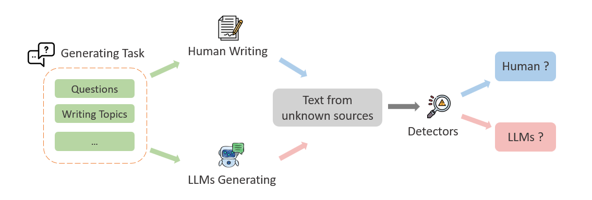
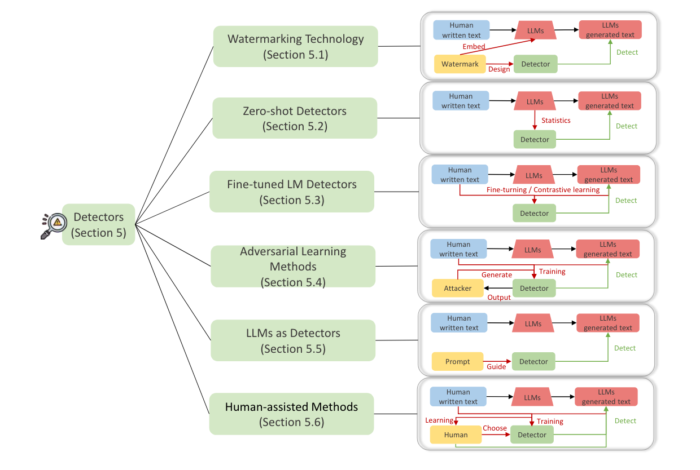

# Awesome LLM-generated Text Detection

[](https://awesome.re)
[](./LICENSE)


The powerful ability of large language models (LLMs) to understand, follow, and generate complex languages has enabled LLM-generated texts to flood many areas of our daily lives at an incredible rate, with potentially negative impacts and risks on society and academia. As LLMs continue to expand, how can we detect LLM-generated texts to help minimize the threat posed by the misuse of LLMs?

<div align="center">
  
</div>
<br>
<!-- **Authors:** -->

**_¹ [Junchao Wu](https://github.com/junchaoIU), ¹ [Shu Yang](https://twitter.com/shuyhere), ¹ [Runzhe Zhan](https://runzhe.me/), ¹ ² [Yulin Yuan](https://fah.um.edu.mo/yulin-yuan/), ¹ [Derek Fai Wong](https://www.fst.um.edu.mo/personal/derek-wong/), ¹ [Lidia Sam Chao]()_**


<!-- **Affiliations:** -->

¹ University of Macau, ² Peking University

## 📢 News
* [2023.10.24] Our survey paper is now available on Arxiv: *[A Survey on LLM-generated Text Detection: Necessity, Methods, and Future Directions](https://arxiv.org/abs/2310.14724)*.
* [2023.10.07] : We start **Chinese LLM-generated Essay Detection** Project.
* [2023.05.01] : We began to explore the topic of LLM-generated Text Detection.

## 🔍 Table of Contents
- [Awesome LLM-generated Text Detection](#awesome-llm-generated-text-detection)
  - [📢 News](#-news)
  - [� Table of Contents](#-table-of-contents)
  - [📃 Papers](#-papers)
    - [Overview](#overview)
    - [Datasets](#datasets)
      - [Benchmarks](#benchmarks)
      - [Potential Datasets](#potential-datasets)
    - [Detector](#detector)
      - [Watermark Technology](#watermark-technology)
      - [Zero-shot Methods](#zero-shot-methods)
      - [Fine-tuning LMs Methods](#fine-tuning-lms-methods)
      - [Adversarial Learning Methods](#adversarial-learning-methods)
      - [LLMs as Detector](#llms-as-detector)
    - [Related Works](#related-works)
      - [Other Surveys](#other-surveys)
  - [🚩 Citation](#-citation)
  - [Contributing](#contributing)

## 📃 Papers
### Overview
A survey and reflection on the latest research breakthroughs in LLM-generated Text detection, including data, detectors, metrics, current issues and future directions. 
Please refer to our article/paper for more details.


### Datasets
#### Benchmarks

| Benchmarks / Datasets                                                              | Use              | Human            | LLMs         |
|------------------------------------------------------------------------------|------------------|------------------|--------------|
| [HC3](https://arxiv.org/abs/2301.07597)                                      | train            | 58k              | 26k          |
| [HC3-Chinese](https://arxiv.org/abs/2301.07597)                              | train            | 22k              | 17k          |
| [CHEAT](https://arxiv.org/abs/2304.12008)                                    | train            | 15k              | 35k          |
| [GROVER Dataset](https://arxiv.org/abs/1905.12616)                           | train valid test | 5k 2k 8k         | 5k 1k 4k     |
| [TweepFake](https://arxiv.org/abs/2008.00036)                                | train            | 12k              | 12k          |
| [GPT-2 Output Dataset](https://github.com/openai/gpt-2-output-dataset)       | train            | 250k             | 250k         |
| [TuringBench](https://aclanthology.org/2021.findings-emnlp.172/)             | train            | 10k              | 190k         |
| [MGTBench](https://arxiv.org/abs/2303.14822)                                 | train test       | 2k 563           | 13k 3k       |
| [ArguGPT](https://arxiv.org/pdf/2304.07666.pdf)                              | train valid test | 3k 350 350       | 3k 350 350   |
| [DeepfakeText-Detect-Dataset](https://arxiv.org/abs/2210.09421)              | train valid test | 95k 29k 29k      | 236k, 29k 28k|
| [M4](https://arxiv.org/abs/2305.14902)                                       | train valid test | 122k 500 500     | 122k 500 500 |
| [GPABenchmark](https://arxiv.org/abs/2306.05524)                             | train            | 600k             | 600k         |
| [Scientific-articles Benchmark](https://aclanthology.org/2023.trustnlp-1.17/)| train test       | 8k 4k            | 8k 4k        |

#### Potential Datasets
| Tasks                              | Datasets                                                                    |
|------------------------------------|-----------------------------------------------------------------------------|
| Questions Answering                | PubMedQA, Children book corpus (CBT), ELI5, TruthfulQA, NarrativeQA         |
| Scientific writing                 | Peer Read, arXiv, TOEFL11                                                   | 
| Story generation                   | WritingPrompts                                                              | 
| News Article writing               | XSum                                                                        | 
| Web Text                           | Wiki40b, WebText, Avax tweets dataset, Climate Change Tweets Ids            | 
| Opinion statements                 | r/ChangeMyView (CMV) Reddit subcommunity, Yelp , IMDB Dataset               | 
| Comprehension and Reasoning        | SciGen, ROCStories Corpora, HellaSwag, SQuAD                                | 

### Detectors
<div align="left">
  
</div>

#### Watermark Technology

| Paper                                                                                                         | Link                                                                                                                                                                                                                                                        |
|---------------------------------------------------------------------------------------------------------------|-------------------------------------------------------------------------------------------------------------------------------------------------------------------------------------------------------------------------------------------------------------|
| A watermark for large language models.                                               | [](https://arxiv.org/abs/2301.10226)      [](https://github.com/jwkirchenbauer/lm-watermarking)                                                                                                          |
| On the Reliability of Watermarks for Large Language Models                                               | [](https://arxiv.org/abs/2306.04634) [](https://github.com/jwkirchenbauer/lm-watermarking)                                                                                                                               |
| A Private Watermark for Large Language Models                          | [](https://arxiv.org/abs/2307.16230) [](https://github.com/THU-BPM/private_watermark)                |
| Distillation-Resistant Watermarking for Model Protection in NLP                          | [](https://arxiv.org/abs/2210.03312) [](https://github.com/xuandongzhao/drw)                |
| Watermarking Pre-trained Language Models with Backdooring                    | [](https://arxiv.org/abs/2210.07543)                                                                                                               |
#### Zero-shot Methods

| Paper                                                                                                         | Link                                                                                                                                                      |
|---------------------------------------------------------------------------------------------------------------|-----------------------------------------------------------------------------------------------------------------------------------------------------------|
| DetectGPT: Zero-Shot Machine-Generated Text Detection using Probability Curvature                             | [](https://arxiv.org/abs/2301.11305) [](https://github.com/eric-mitchell/detect-gpt)             |
| Fast-DetectGPT: Efficient Zero-Shot Detection of Machine-Generated Text via Conditional Probability Curvature | [](https://arxiv.org/abs/2310.05130) [](https://github.com/baoguangsheng/fast-detect-gpt)        |
| Efficient Detection of LLM-generated Texts with a Bayesian Surrogate Model                                    | [](https://arxiv.org/abs/2305.16617)                              |
| DetectLLM: Leveraging Log Rank Information for Zero-Shot Detection of Machine-Generated Text                  | [](https://arxiv.org/abs/2306.05540) [](https://github.com/mbzuai-nlp/detectllm)                 |
| GLTR: Statistical Detection and Visualization of Generated Text                                               | [](https://arxiv.org/abs/1906.04043) [](https://github.com/HendrikStrobelt/detecting-fake-text)  |
| HowkGPT: Investigating the Detection of ChatGPT-generated University Student Homework through Context-Aware Perplexity Analysis           | [](https://arxiv.org/abs/2305.18226) |
| Intrinsic Dimension Estimation for Robust Detection of AI-Generated Texts           | [](https://arxiv.org/abs/2306.04723) |

#### Fine-tuning LMs Methods

| Paper                                                                                                         | Link                                                                                                                                                                                                                                                        |
|---------------------------------------------------------------------------------------------------------------|-------------------------------------------------------------------------------------------------------------------------------------------------------------------------------------------------------------------------------------------------------------|
| How Close is ChatGPT to Human Experts? Comparison Corpus, Evaluation, and Detection                                               | [](https://arxiv.org/abs/2301.07597)      [](https://github.com/hello-simpleai/chatgpt-comparison-detection)                                        |
| Multiscale Positive-Unlabeled Detection of AI-Generated Texts                         | [](https://arxiv.org/abs/2305.18149) [](https://github.com/yuchuantian/aigc_text_detector)                |
| Real or fake? Learning to discriminate machine from human generated text                         | [](https://arxiv.org/abs/1906.03351)             |
| Automatic Detection of Generated Text is Easiest when Humans are Fooled                         | [](https://arxiv.org/abs/1911.00650)             |
| Stylometric Detection of AI-Generated Text in Twitter Timelines           | [](https://arxiv.org/abs/2303.03697)          |
| TweepFake: about Detecting Deepfake Tweets          | [](https://arxiv.org/abs/2008.00036) [](https://github.com/tizfa/tweepfake_deepfake_text_detection)           |
| Towards a Robust Detection of Language Model Generated Text: Is ChatGPT that Easy to Detect?     | [](https://arxiv.org/abs/2306.05871)           |
| Deepfake Text Detection in the Wild| [](https://arxiv.org/abs/2305.13242) [](https://github.com/yafuly/deepfaketextdetect)             |
| ArguGPT: evaluating, understanding and identifying argumentative essays generated by GPT models| [](https://arxiv.org/abs/2304.07666) [](https://github.com/huhailinguist/ArguGPT)             |
| Check Me If You Can: Detecting ChatGPT-Generated Academic Writing using CheckGPT| [](https://arxiv.org/abs/2306.05524)             |
| GPT-Sentinel: Distinguishing Human and ChatGPT Generated Content | [](https://arxiv.org/abs/2305.07969) |
| Neural Deepfake Detection with Factual Structure of Text| [](https://arxiv.org/abs/2010.07475)            |
| ConDA: Contrastive Domain Adaptation for AI-generated Text Detection | [](https://arxiv.org/abs/2309.03992) [](https://github.com/AmritaBh/ConDA-gen-text-detection)            |

#### Adversarial Learning Methods
| Paper                                                                                                         | Link                                                                                                                                                  |
|---------------------------------------------------------------------------------------------------------------|-------------------------------------------------------------------------------------------------------------------------------------------------------|
| RADAR: Robust AI-Text Detection via Adversarial Learning                                                      | [](https://arxiv.org/abs/2307.03838)                          |
| OUTFOX: LLM-generated Essay Detection through In-context Learning with Adversarially Generated Examples       | [](https://arxiv.org/abs/2307.11729) [](https://github.com/ryuryukke/OUTFOX)                     |
| Red Teaming Language Model Detectors with Language Models                                                     | [](https://arxiv.org/abs/2305.19713) [](https://github.com/shizhouxing/LLM-Detector-Robustness)                     |
| Is ChatGPT Involved in Texts? Measure the Polish Ratio to Detect ChatGPT-Generated Text       | [](https://arxiv.org/abs/2307.11380)                     |

#### LLMs as Detector
| Paper                                                                                                         | Link                                                                                                                               |
|---------------------------------------------------------------------------------------------------------------|------------------------------------------------------------------------------------------------------------------------------------|
|  Fighting fire with fire: Can chatgpt detect ai-generated text?                                             | [](https://arxiv.org/abs/2308.01284)   [](https://github.com/amritabh/chatgpt-as-detector)                                     |
| OUTFOX: LLM-generated Essay Detection through In-context Learning with Adversarially Generated Examples                         | [](https://arxiv.org/abs/2307.11729) [](https://github.com/ryuryukke/OUTFOX)                |
| GPT Paternity Test: GPT Generated Text Detection with GPT Genetic Inheritance                       | [](https://arxiv.org/abs/2305.12519)                |

### Related Works
#### Other Surveys
| Paper                                                                                                         | Link                                                                                                                                |
|---------------------------------------------------------------------------------------------------------------|-------------------------------------------------------------------------------------------------------------------------------------|
| Automatic Detection of Machine Generated Text: A Critical Survey                         | [](https://arxiv.org/abs/2011.01314)             |
| The Science of Detecting LLM-Generated Texts                         | [](https://arxiv.org/abs/2303.07205)             |
| Machine Generated Text: A Comprehensive Survey of Threat Models and Detection Methods                         | [](https://arxiv.org/abs/2210.07321)             |            |
| Computer-Generated Text Detection Using Machine Learning: A Systematic Review                         | [](https://link.springer.com/chapter/10.1007/978-3-319-41754-7_43)      |
| Attribution and Obfuscation of Neural Text Authorship: A Data Mining Perspective                         | [](https://arxiv.org/abs/2210.10488)             |


## 🚩 Citation

If our research helps you, please kindly cite our paper.

```bibtex
@article{wu2023survey,
      title={A Survey on LLM-gernerated Text Detection: Necessity, Methods, and Future Directions}, 
      author={Junchao Wu and Shu Yang and Runzhe Zhan and Yulin Yuan and Derek F. Wong and Lidia S. Chao},
      journal      = {CoRR},
      volume       = {abs/2310.14724},
      year         = {2023},
      url          = {https://arxiv.org/abs/2310.14724},
      eprinttype   = {arXiv},
      eprint       = {2310.14724},
```


## Contributing
Contributions are welcome! If you have any ideas, suggestions, or bug reports, please open an issue or submit a pull request. We appreciate your contributions to making LLM-generated Text Detection work even better.


